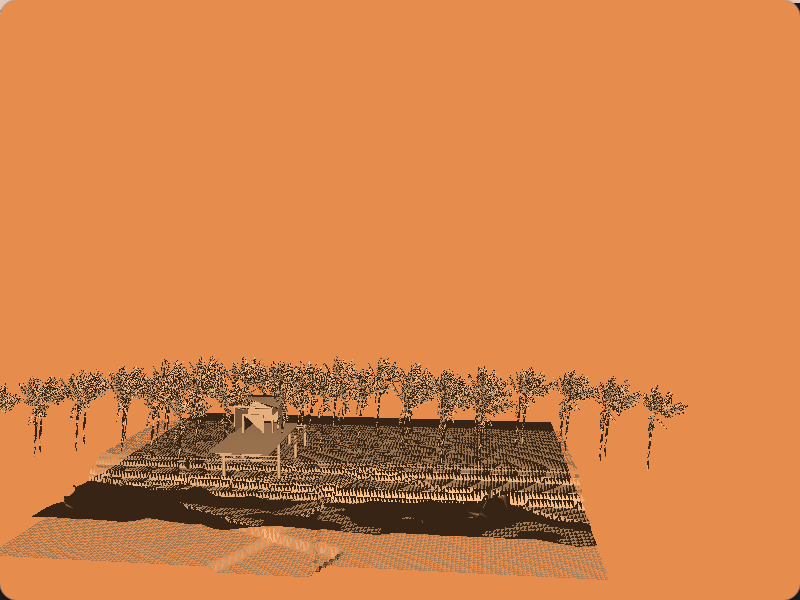

# Proyecto 3D — OpenGL

Este proyecto es una práctica de visualización 3D utilizando **OpenGL**, **GLUT**, **GLEW**, y un cargador OBJ personalizado.  
Incluye manejo básico de cámara, iluminación y carga de texturas.

---

## 📷 Captura de prueba

A continuación se muestra una imagen de referencia de cómo debería verse la escena renderizada:



---

## ▶ Compilación

Compila el proyecto con:

```bash
g++ main.cpp glApplication.cpp glutWindow.cpp glm.c -o proyecto3d \
-lGLEW -lglut -lGL -lGLU -lm
